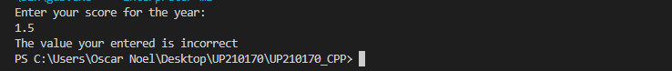
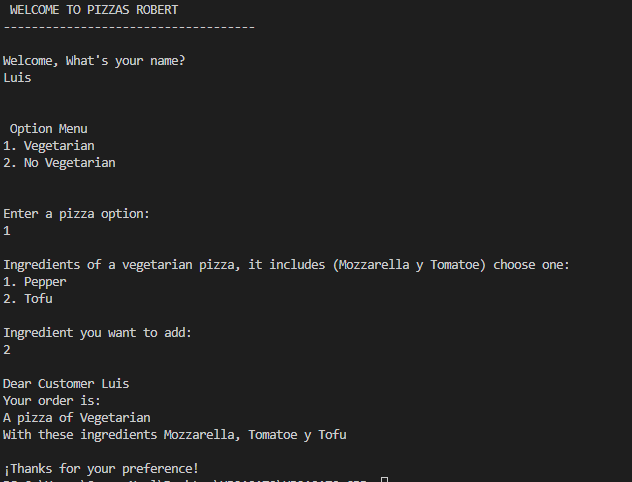
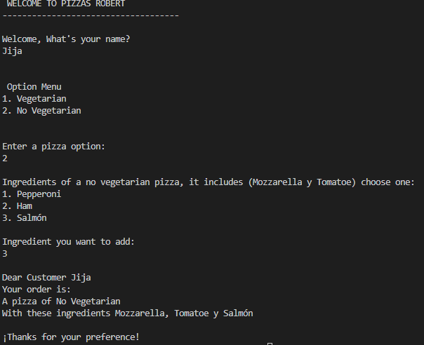

<h1>
WELCOME TO UNIT 2: CONTROL STRUCTURES AND CYCLES


## Index:
- [Exercise 1](#exercise-1-a-program-that-asks-the-user-for-his-annual-rent-and-exhibit-the-corresponding-tax-rate)
- [Exercise 2](#exercise-2-a-program-that-asks-the-user-for-his-employment-score-and-show-his-final-salary)
- [Exercise 3](#exercise-3-ask-the-age-and-show-the-entry-price-games-room)
- [Exercise 4](#exercise-4-ask-the-client-what-pizza-do-you-want-and-select-the-ingredients)
- [Exercise 5](#exercise-5-ask-the-user-for-six-temperatures)
- [Exercise 6](#exercise-6-program-where-you-enter-a-number-of-products-and-a-price-at-the-end-it-prints-the-total)
- [Exercise 7](#exercise-7-decimal-to-binary-conversion)
- [Exercise 8](#exercise-8-multiplication-table)
- [Exercise 9](#exercise-9-bisection-method)


# Exercise 1: A program that asks the user for his annual rent and exhibit the corresponding tax rate
- [Welcome](#welcome-to-unit-2-control-structures-and-cycles)
## Preprocessor directives (c++)
```c++
#include <iostream>
#include <stdio.h>
```

## Input (c++)
```c++
//request for annual rent
   cout << "Enter your annual rent: \n";
   cin >> rent;
```

## Processing (c++)
```c++
    //Processing 
    if(rent > 0){
        if((rent < 10000) || (rent >=10000 & rent < 20000) || (rent >= 20000 & rent < 35000) || (rent >= 35000 & rent < 60000) || (rent >= 60000)){
        if (rent < 10000){
            descuento = rent*.05;
        }

        if(rent >= 10000 & rent < 20000){
            descuento = rent*.15;
        }

        if(rent >= 20000 & rent < 35000){
            descuento = rent*.20;
        }

        if(rent >= 35000 & rent < 60000){
            descuento = rent*.30;
        }

        if(rent >= 60000) {
            descuento = rent*.45;
        }
        }
    }else {
        cout << "The data you entered is incorrect" << endl;
    }
```

## Output
```c++
//Data output
    cout << "Your data is: " << endl;
    cout << "* Your annual rent is: " << "$" << rent << endl;
    cout << "* Your tax is: " << taxes1 << "%" << endl;
    cout << "* Must pay: " << "$" << descuento << endl;
```


## Explanation
1. Ask the user for his annual rent
2. Check if the entered value is correct
3. If it is not correct, you will receive an alert
4. If the rent is minor than $10,000 the tax it is 5%
5. If the rent is greater or equal than to $10,000 and minor than $20,000 the tax it is 15%
6. If the rent is greater or equal than to $20,000 and minor tha $35,000 the tax it is 20%
7. If the rent is greater or equal than to $35,000 and minor than $60,000 the tax it is 30%
8. If the rent is greater or equal than $60,000 the tax it is 45%
9. Printf the tax rate and the new annual rent

## Screen shots
### - Rent < $10,000


### - Rent >= $10,000 and Rent < $20,000


### - Rent >= $20,000 and Rent < $35,000


### - Rent >= $35,000 and Rent < $60,000


### - Rent >= $60,000 


# Exercise 2: A program that asks the user for his employment score and show his final salary
- [Welcome](#welcome-to-unit-2-control-structures-and-cycles)

## Preprocessor directives (c++)
```c++
#include <iostream>
#include <stdio.h>
```    

## Input (c++)
```c++
    //request his annual score 
    cout << "Enter your score for the year: " << endl;
    cin >> puntuacion;
```

## Processing (c++)
```c++
    //Processing
    if(puntuacion <= 1){
         if((puntuacion == 0.4) || (puntuacion >= 0.6) || (puntuacion == 0.0)){

        //if de acorde al nivel ingresado
        if(puntuacion == 0.0){
            cout << "Your level of performance is Unacceptable" << endl;
        }
        else if(puntuacion == 0.4){
            cout << "Your level of performance is Acceptable" << endl;
        }
        else if(puntuacion >= 0.6){
            cout << "Your level of performance is Meritorious" << endl;
        }
    }
        
    }else{
        cout << "The value your entered is incorrect" << endl;
    }
```

## Output
```c++
    //Output
    cout << "Your final money is: " << "$" << sueldo1 << endl;
```

## Explanation 
1. Ask the user for his annual score in the company
2. Check if the entered value is correct
3. The level when the score is == 0.0 is "Unacceptable" , == 0.4 is "Acceptable" and >= 0.6 is "Meritorious"  
4. The score is multiplied by 2400
5. If the score is equal than 0.0 the new salary is $0 (0.0 (2400) = $0)
6. If the score is equal than 0.4 the new salary is $960 (0.4(2400) = $960)
7. If the score is equal or greater than 0.6 the new salary it varies 
8. If the score is greater than 1, you receive an alert
9. Printf the performance level and new annual salary

## Screen shots
### - Score == 0.0


### - Score == 0.4


### - Score >= 0.6


### - Score > 1



# Exercise 3: Ask the age and show the entry price (Games room)
- [Welcome](#welcome-to-unit-2-control-structures-and-cycles)

## Preprocessor directives (c++)
```c++
#include <iostream>
#include <stdio.h>
```    
## Input (c++)
```c++
  // Input
    cout << "Enter your age: " << endl;
    cin >> edad;
```

## Processing (c++)
```c++
if (edad > 1)
    {
        if ((edad < 4) || (edad >= 4 && edad <= 18) || (edad > 18))
        {
            if (edad < 4)
            {
                precio = 0;
            }
            else if (edad >= 4 && edad <= 18)
            {
                precio = 5;
            }
            else if (edad > 18)
            {
                precio = 10;
            }
        }
    }else{
        cout << "The age entered is incorrect" << endl;
    }
```
## Output (c++)
```c++
//Output
        cout << "The price to pay is: "
            << "$" << precio << endl;
```
## Explanation
1. Ask the client for his age 
2. Check if the entered value is correct
3. If the client's age is minor than 4, the admission price is $0 (FREE)
4. If the client's age is greater or equal than 4 and minor o equal than 18 the admission price is $5
5. If the client's age is greater than 18, the admission price is $10
6. If the age is minor than 1, you receive an alert
7. Printf the admission price 

## Screen shots
### - Age < 4


### - Age >= 4 or Age <= 18


### - Age > 18


### - Age < 1


# Exercise 4: Ask the client what pizza do you want and select the ingredients 
- [Welcome](#welcome-to-unit-2-control-structures-and-cycles)

## Preprocessor directives (c++)
```c++
#include <iostream>
#include <stdio.h>
```   

## Input (c++)
```c++
//Input
    cout << "\nWelcome, What's your name?" << endl;
    cin >> nombre;


    cout << "\n\n Option Menu" << endl;
    cout << "1. Vegetarian" << endl;
    cout << "2. No Vegetarian" << endl;

    cout << "\n\nEnter a pizza option: " << endl;
    cin >> pizza;
```

## Processing (c++)
```c++
    //Processing 
if ((pizza == 1) || (pizza == 2))
    {
        if (pizza == 1)
        {
            pizzav = "Vegetarian";
            cout << "\nIngredients of a vegetarian pizza, it includes (Mozzarella y Tomatoe) choose one: " << endl;
            cout << "1. Pepper" << endl;
            cout << "2. Tofu" << endl;

            cout << "\nIngredient you want to add:" << endl;
            cin >> ingrediente;

            if (ingrediente == 1)
            {
                ingre = "Pepper";
            }
            else if (ingrediente == 2)
            {
                ingre = "Tofu";
            }else{
                cout << "This ingredient doesn't exits" << endl;
            }
        }
        if (pizza == 2)
        {
            pizzav = "No Vegetarian";
            cout << "\nIngredients of a no vegetarian pizza, it includes (Mozzarella y Tomatoe) choose one: " << endl;
            cout << "1. Pepperoni" << endl;
            cout << "2. Ham" << endl;
            cout << "3. Salmón" << endl;

            cout << "\nIngredient you want to add:" << endl;
            cin >> ingrediente;

            if (ingrediente == 1)
            {
                ingre = "Pepperoni";
            }
            else if (ingrediente == 2)
            {
                ingre = "Ham";
            }
            else if (ingrediente == 3)
            {
                ingre = "Salmón";
            }else{
                cout << "This ingredient doesn't exits" << endl;
            }
        }

    }else {
        cout << "The entered value was not found" << endl;
    }
```

## Output (c++)
```c++
 //Output
    cout << "\nDear Customer " << nombre << endl;
    cout << "Your order is: " << endl;
    cout << "A pizza of " << pizzav << endl;
    cout << "With these ingredients Mozzarella, Tomatoe y " << ingre << endl;
    cout << "\n¡Thanks for your preference!" << endl;
```

## Explanation
1. Ask the client what pizza do you want and what ingredient do you want
2. (1) Vegetarian (2) No Vegetarian 
3. Vegetarian - (1) Pimiento (2) Tofu
4. No Vegetarian - (1) Peperoni (2) Jamón (3) Salmón
5. Printf the type pizza, ingredients and name of the client
6. If the number selecction is different to 1 or 2 you receive an alert

## Screen shots
### - Pizza Vegetarian with Pimiento


### - Pizza Vegetarian with Tofu


### - Pizza No vegetarian with Peperoni


### - Pizza No vegetarian with Jamón


### - Pizza No vegetarian with Salmón


### - Invalid Number


# Exercise 5: Ask the user for six temperatures
- [Welcome](#welcome-to-unit-2-control-structures-and-cycles)

## Preprocessor directives (c++)
```c++
#include <iostream>
```

## Input (c++)
```c++
//Input
    cout << "Give me the temperature: " << endl;
    cin >> temperatura;
```

## Processing (c++)
```c++
do{
     //Input
    cout << "Give me the temperature: " << endl;
    cin >> temperatura;
    tempAcum += temperatura;

    if(temperatura < drop){
        drop = temperatura;
    }
    if(temperatura > high){
        high = temperatura; 
    }

    contador++;
    } while (contador <= 6);
```

## Output (c++)
```c++
    cout << "The average of temperature today is: " << tempAcum/6 << endl;
    cout << "The highest temperature is: " << high << endl;
    cout << "The lower temperature is: " << drop << endl;
```

## Explanation
1. Ask for six temperatures
2. If temperature is bigger than the previous, the data is saved
3. If temperature is lower than the previous, the data is saved
4. On the screen:
4.1 The average of the temperatures  
4.2 The highest temperature  
4.3 The lower temperature  

## Screen shots
### Demonstration


# Exercise 6: Program where you enter a number of products and a price. At the end it prints the total
- [Welcome](#welcome-to-unit-2-control-structures-and-cycles)

## Preprocessor directives (c++)
```c++
#include <iostream>
```

## Input (c++)
```c++
//Input 
    cout << "Enter number of products: ";
    cin >> amount;
```

## Processing (c++)
```c++
 //Processing
    do{
        //Input 
        cout << "Enter number of products: ";
        cin >> amount;

        if(amount != 0){
            cout << "Price of the product: " << "$";
            cin >> price;

            total = amount * price + total;
        }
        
    }while(amount != 0);
```

## Output (c++)
```c++
 //Output
    cout << "The total invoice to pay is: " << "$" << total << endl;
```

## Explanation
1. Ask number of products and also their price
2. Multiply number of products by price
3. To finish the purchase enter 0
4. Print the invoice of the total purchase

## Screen shots
### A purchase


# Exercise 7: Decimal to binary conversion
- [Welcome](#welcome-to-unit-2-control-structures-and-cycles)

## Preprocessor directives (c++)
```c++
#include <iostream>
```

## Input (c++)
```c++
    cout << "Decimal to binary conversion program" << endl;
    cout << "Enter the decimal number: ";
    cin >> deci;
```

## Processing (c++)
```c++
if(deci < 0){
    cout << "Must be greater than 0" << endl;
}

    do
    {
        if (deci > 0)
        {
            while(deci != 0){
                /*resultado = to_string(deci%2) + resultado;*/
                resultado = (deci%2 == 0)?"0" + resultado : "1" + resultado;
                deci /= 2;
            }
            cout << "The binary number is: " << resultado << endl;
        }
        else if (deci == 0)
        {
            cout << "0" << endl;
        }
    }while(deci < 0);
```

## Output (c++)
```c++
     cout << "The binary number is: " << resultado << endl;
```

## Explanation
1. Enter decimal number
2. It must be greater than 0, if it is less, the conversion does not proceed
3. If it is greater, the conversion to binary is performed
4. Print the number in binary

## Screen shots
### Conversion 1 > 0


# Exercise 8: Multiplication table
- [Welcome](#welcome-to-unit-2-control-structures-and-cycles)

## Preprocessor directives (c++)
```c++
#include <iostream>
```

## Input (c++)
```c++
    cout << "Enter a table limit: ";
    cin >> limite;

    cout << "Enter a whole number: ";
    cin >> numero;
```

## Processing (c++)
```c++
    if (numero <= 1 || numero >= 1)
    {
        for (i = 1; i <= limite; i++)
        {
            if (i == 1)
            {
                for (int espacio = 0; espacio <= 39; espacio++)
                {
                    cout << "-";
                }
                cout << "\n";
            }
            
            cout << "|" << i << "\t x \t" << numero << "\t = \t" << (numero * i) << "\t|\n";

            for (int espacio = 0; espacio <= 39; espacio++)
            {
                cout << "-";
            }
            cout << "\n";
        }
    }
```

## Output (c++)
```c++
    cout << "The number table" << numero << endl;
```

## Explanation
1. Enter a limit of values ​​from the table
2. Then, enter the integer to display your table
3. All values ​​in the data are accepted. not at the limit
4. Print the table

## Screen shots
### Table 8 


# Exercise 9: Bisection method 
- [Welcome](#welcome-to-unit-2-control-structures-and-cycles)

## Preprocessor directives (c++)
```c++
#include <iostream>
#include <cmath>
#include <iomanip> //Para el set precision 
```

## Input (c++)
```c++
//Input 
    cout << "Ingresa el valor de a: ";
    cin >> a;

    cout << "Ingresa el valor de b: ";
    cin >> b;
```

## Processing (c++)
```c++
//Procesing 
    do{
         ya = plantearecuacion (a);
         yb = plantearecuacion (b);
         c = (a+b)/2;
         yc = plantearecuacion (c);

        cout << "| " << interador << fixed << setprecision(8) << "\t\t| " << a << "\t\t| " << b << "\t\t| " << c << "\t\t| " << ya << "\t\t| " << yb << "\t\t| " << yc << "\t\t| \n"; //Se imprimen los resultados de cada columna 
        imprimirtabla();
        
        if((ya * yc) < 0){
            b = c;
        }else{
            a = c;
        }


        if(a == b){
            solucion = 0;
            break;
        }

        interador++;

    }while(abs(yc) >= margenerror);
```

## Output (c++)
```c++
//Output
    if(solucion != 0){
            cout << "The root is: " << setprecision(3) << c << "\n";
    }else{
            cout << "These numbers have no range";
    }
```

## Explanation
1. The values ​​of a and b are requested.
2. Calculate the value of c
3. Get the values ​​of y with a,b and c
4. if (ya * yc) is minor than 0 b = c and if not a = c
5. When the value of and c are between greater than or equal to 0.01 or less than or equal to -0.01 exit the while
6. Printf the table 

## Screen shots
### a = 1 b = 10 

