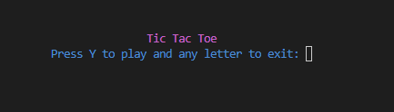
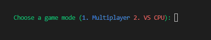
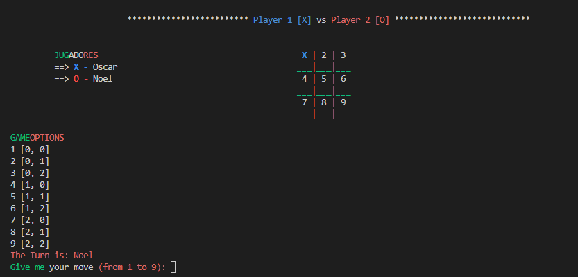
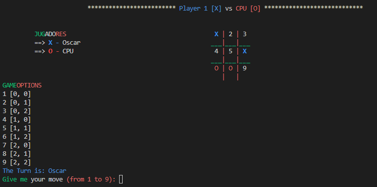

# WELCOME TO UNIT 3: TIC TAC TOE GAME 
  
 

  
## Index
 - [Instructions for execution and use](#instructions-for-execution-and-use)
 - [Flowchart](#flowchart)
 - [Development and explanation of code execution](#development-and-explanation-of-code-execution)
 - [Conclusions](#conclusions)

## Instructions for execution and use 
To enjoy and compete in this game, you must follow this series of steps (depending on your operating system):

<h2> a) LINUX </h2>
1. First, clone my repository with the following command (:)

~~~
"git clone https://github.com/UP210170/UP210170_CPP"
~~~

2. Then install GNU c/c++ in the terminal (:)

  2.1 Update package list
  
  ~~~
  $ sudo apt update
  ~~~
  
  2.2 Install the package
  
  ~~~
  $ sudo apt install build-essential
  ~~~
  
  2.3 Verify the installation
  
  ~~~
  gcc --version
  ~~~
  
3. Compile the program, with the following command (:)

 ~~~
 gcc 01_JuegodelGato.c 
 ~~~
 
4. Run the program, with the following command

 ~~~
 ./01JuegodelGato
 ~~~

<h2> b) WINDOWS </h2>

* First, clone my repository with the following command (:)

~~~
"git clone https://github.com/UP210170/UP210170_CPP"
~~~

* Download the following compile for proper functioning

~~~
https://www.fdi.ucm.es/profesor/luis/fp/devtools/mingw.html
~~~

* Find the program in the terminal, with the following command (:)

~~~
cd C:\Desktop\...
~~~

* Compile the program, with the following command (:)

~~~
gcc 01_JuegodelGato.cpp or 01_JuegodelGato.exe
~~~

* Run the program, with the following command (:)

~~~
01_JuegodelGato.exe
~~~

[Return to Index](#index)

## Flowchart 

[Return to Index](#index)

## Development and explanation of code execution
In the game you should consider these points:
* When entering a move, do not enter decimal numbers or letters
* The symbols are already assigned [X][O] (Multiplayer = Player 1 [X] Player 2 [O] || Vs CPU = Player [X] CPU [O])

<h2> Multiplayer Player 1 vs Player 2 </h2>

When starting the game, it shows the game menus

 
 

 

Once inside the game, player 1 will select his first move

 
 

 

Once the move has been entered, the second player selects his move (with care not to repeat the move)

 
 

 

If any player selects a move that is busy, he is sent a message to try another move

 
 

 

Here are the winners

 
 

 

 
 

  

[Return to Index](#index)

<h2> Player vs CPU </h2>

When starting the game, it shows the game menus

 
 

 

Two difficulty levels (easy and medium) are added in the Player vs CPU game

 
 

 

Once inside the game, player 1 will select his first move. And the computer responds with a move to avoid winning and seek to win

 
 

 

Here are the winners

 

 

[Return to Index](#index)

## Conclusions 
This program was the first most complex that we have practiced, at the beginning when making the first game mode PLAYER vs PLAYER it was something simple but when the time came to make the second game mode PLAYER vs CPU it was very complicated to do intelligence artificial and make the PC think of a play where they can win. One of the new things that was made was a duplicate or imaginary matrix for the PC and think of a play that won against the player The sources from which information was extracted were:
1. The teacher
2. Artificial intelligence explanation videos
3. Play in the notebook to analyze the plays
This serves as experience and be prepared in the near future

[Return to Index](#index)
